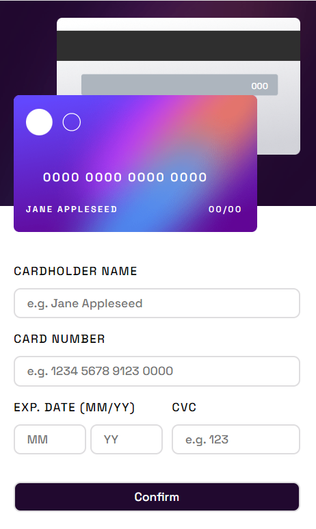

# Frontend Mentor - Interactive card details form solution

This is a solution to the [Interactive card details form challenge on Frontend Mentor](https://www.frontendmentor.io/challenges/interactive-card-details-form-XpS8cKZDWw). Frontend Mentor challenges help you improve your coding skills by building realistic projects. 

## Table of contents

- [Overview](#overview)
  - [The challenge](#the-challenge)
  - [Screenshot](#screenshot)
  - [Links](#links)
- [My process](#my-process)
  - [Built with](#built-with)
  - [What I learned](#what-i-learned)
  - [Continued development](#continued-development)
  - [Useful resources](#useful-resources)
- [Author](#author)

## Overview

### The challenge

To build out this interactive card details form and get it looking as close to the design as possible both on mobile and desktop screens.

TODO (when React will be implemented):

Users should be able to:

- Fill in the form and see the card details update in real-time
- Receive error messages when the form is submitted if:
  - Any input field is empty
  - The card number, expiry date, or CVC fields are in the wrong format
- View the optimal layout depending on their device's screen size
- See hover, active, and focus states for interactive elements on the page

### Screenshot

### Links

- Live Site URL: To be added

## My process

### Built with

- Semantic HTML5 markup
- CSS custom properties
- Flexbox
- Mobile-first workflow
- JavaScript

### What I learned

So far: various practical aspects of CSS (layout, media queries, positioning, alignments), planning a style guide, working with images (png, svg) as themselves and as background.

### Continued development

- React implementation
- Form validation
- Fixing bugs for screen sizes

### Useful resources

Pluralsight courses:

- [Creating Page Layouts with CSS](https://app.pluralsight.com/library/courses/css-creating-page-layouts/table-of-contents)
- [Modern Web Layout with Flexbox and CSS Grid](https://app.pluralsight.com/library/courses/modern-web-layout-flexbox-css-grid/table-of-contents)
- [Creating a Living Style Guide with Sass and Vanilla JavaScript](https://app.pluralsight.com/library/courses/creating-living-style-guide-sass-vanilla-javascript/table-of-contents)
- [Adding Graphics to Web Pages Using Canvas and SVG](https://app.pluralsight.com/library/courses/adding-graphics-web-pages-using-canvas-svg/table-of-contents)
- [Working with Colors and Images in CSS](https://app.pluralsight.com/library/courses/working-colors-images-css/table-of-contents)

## Author

- Website - To be added
- Twitter - To be added

## Acknowledgments

This is where you can give a hat tip to anyone who helped you out on this project. Perhaps you worked in a team or got some inspiration from someone else's solution. This is the perfect place to give them some credit.